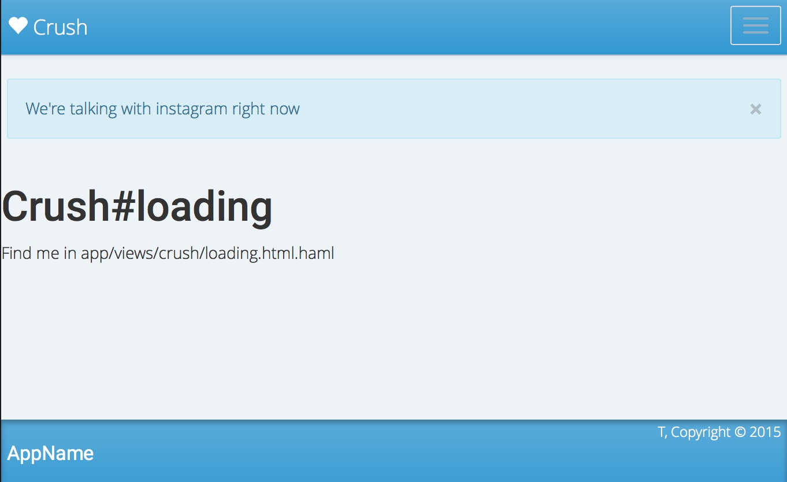

# Adding a Job Processor

Now that we've put ActiveJob into the system, lets setup a job processor so we can see what it does.  We'll use `delayed_job` at first, since that doesn't require a new database backend.

## DelayedJob

In your `Gemfile` we add:

```
gem 'delayed_job_active_record'
```

Then run:

```
$ bundle
$ rails generate delayed_job:active_record
$ rake db:migrate
```

This creates a `delayed_jobs` table where the jobs get stored, and then polled from a seperate worker process.  Lets open up our `Procfile` and setup that process to run:

```
web: bundle exec puma -C config/puma.rb
worker: bundle exec rake jobs:work
```

Now lets startup a server using `foreman start`.  In the logs now you should we stuff from `web.1` which is the puma/rails process, and `worker.1` which is our delayed job.  It's probably polling quite a lot.

## Testing out queuing

Inside of `instagram_user.rb`, lets expose our sync method with a little refactoring:

```
  def sync_if_needed
    if stale? && state != "queued"
      sync!
    end
  end

  def sync!
    update_attribute :state, "queued"
    UpdateUserFeedJob.perform_later( self.id )
  end
```

Now lets start up the console and see what happens:

```
$ rails c
[1] instacrush_tutorial »  InstagramUser.first.sync!
```

And we get pages of SQL queries! _The reason that it didn't work is that we never told rails about the queing_.  Lets go and add that now inside of `application.rb`:

```
    config.active_job.queue_adapter = :delayed_job
```

And restart foreman and the rails console.  Now when we run the sync command from the console we get:

```
[1] instacrush_tutorial »  InstagramUser.first.sync!
Enqueued UpdateUserFeedJob (Job ID: b58ef359-ff28-4c3f-96dd-adeacd3cc598) to DelayedJob(default) with arguments: 1
[ActiveJob] Enqueued UpdateUserFeedJob (Job ID: b58ef359-ff28-4c3f-96dd-adeacd3cc598) to DelayedJob(default) with arguments: 1
[ActiveJob]    (0.7ms)  commit transaction
=> #<UpdateUserFeedJob:0x007f995552d258 @arguments=[1], @job_id="b58ef359-ff28-4c3f-96dd-adeacd3cc598", @queue_name="default">

```

And if we flip back to the foreman log you can see the job running.

Let's clear out the sync state in the console, and see what we see on the front end.

```
[2] instacrush_tutorial »   InstagramUser.first.update_attribute( :last_synced, 1.day.ago )
```



That's not what we want!  Lets move over our previous design.

```
$ mv app/views/welcome/calculating.html.haml app/views/crush/loading.html.haml
```

And change it to refresh the page:

```
          window.location = '#{ loading_crush_index_path }';
```

Lets reset our user once again:

```
[10] instacrush_tutorial »  InstagramUser.first.update_attribute( :last_synced, 1.day.ago )
```

Now we see our nice loader, and when the bar is up, the page refreshes to either the loading page, or the crush itself.

## More testing

Lets delete all the instagram data in the database and see what happens.

```
[18] instacrush_tutorial »  InstagramUser.destroy_all; InstagramMedia.destroy_all; InstagramInteraction.destroy_all; Crush.destroy_all
```

And go back to our page, and we see an never ending loading page.  That is refreshing over and over... lets look at the logs... **disaster!!**

Lets go back to the console and examine the objects in play.

```
[22] instacrush_tutorial »  u = User.first
=> #<User:0x007fc6ce68bd38> {
                      :id => 1,
                   :email => "",
      :encrypted_password => "",
    :reset_password_token => nil,
  :reset_password_sent_at => nil,
     :remember_created_at => nil,
           :sign_in_count => 1,
      :current_sign_in_at => Tue, 03 Nov 2015 19:07:43 UTC +00:00,
         :last_sign_in_at => Tue, 03 Nov 2015 19:07:43 UTC +00:00,
      :current_sign_in_ip => "127.0.0.1",
         :last_sign_in_ip => "127.0.0.1",
              :created_at => Tue, 03 Nov 2015 19:07:43 UTC +00:00,
              :updated_at => Tue, 03 Nov 2015 19:07:43 UTC +00:00
}
[23] instacrush_tutorial »  u.should_sync?
=> false
[24] instacrush_tutorial »  u.instagram_user
=> #<InstagramUser:0x007fc6ce4300c0> {
               :id => 82,
          :user_id => 1,
      :last_synced => nil,
         :username => "wschenk",
        :full_name => nil,
  :profile_picture => nil,
      :media_count => nil,
   :followed_count => nil,
  :following_count => nil,
       :created_at => Tue, 03 Nov 2015 19:54:57 UTC +00:00,
       :updated_at => Tue, 03 Nov 2015 19:54:57 UTC +00:00,
            :state => "queued"
}
```

Hm.  It thinks that it should be syncing, but it's not doing anything.

Lets look at the job itself:

```
[26] instacrush_tutorial »  Delayed::Job.first
=> #<Delayed::Backend::ActiveRecord::Job:0x007fc6ccdd9308> {
          :id => 11,
    :priority => 0,
    :attempts => 3,
     :handler => "--- !ruby/object:ActiveJob::QueueAdapters::DelayedJobAdapter::JobWrapper\njob_data:\n  job_class: UpdateUserFeedJob\n  job_id: 53fb8887-154f
-4009-94c3-08940fa54cd3\n  queue_name: default\n  arguments:\n  - 82\n  locale: :en\n",
  :last_error => "Couldn't find User with 'id'=82\n/Users/wschenk/.rvm/gems/ruby-2.2.2/gems/activerecord-4.2.4/lib/active_record/core.rb:155:in `find'\n/Users
```

And then it goes on forever.  This doesn't make sense though, since we are `User` with id of `1`, and it's trying to sync a `User` with an ID of `82`.  Lets look at where we are calling our job and make sure we are passing in User ids and not `InstagramUser` ids.  

Sure enough, in `instagram_user.rb` we need to change the `sync!` method to:

```
  def sync!
    update_attribute :state, "queued"
    UpdateUserFeedJob.perform_later( self.user.id )
  end
```
`
dsf

