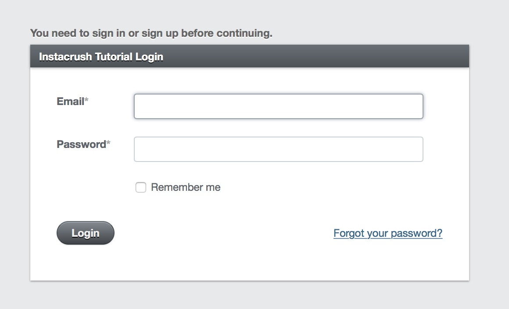
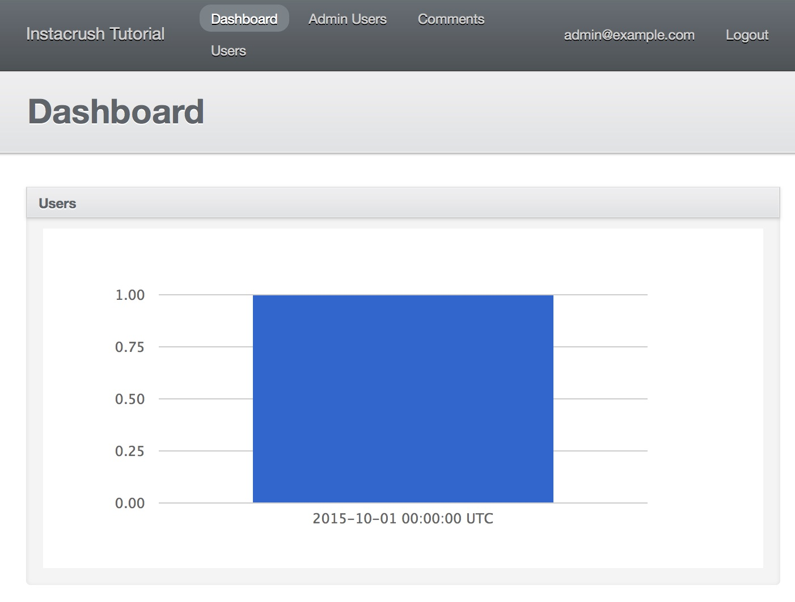
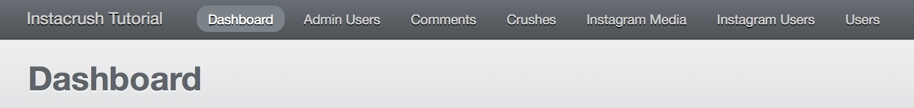
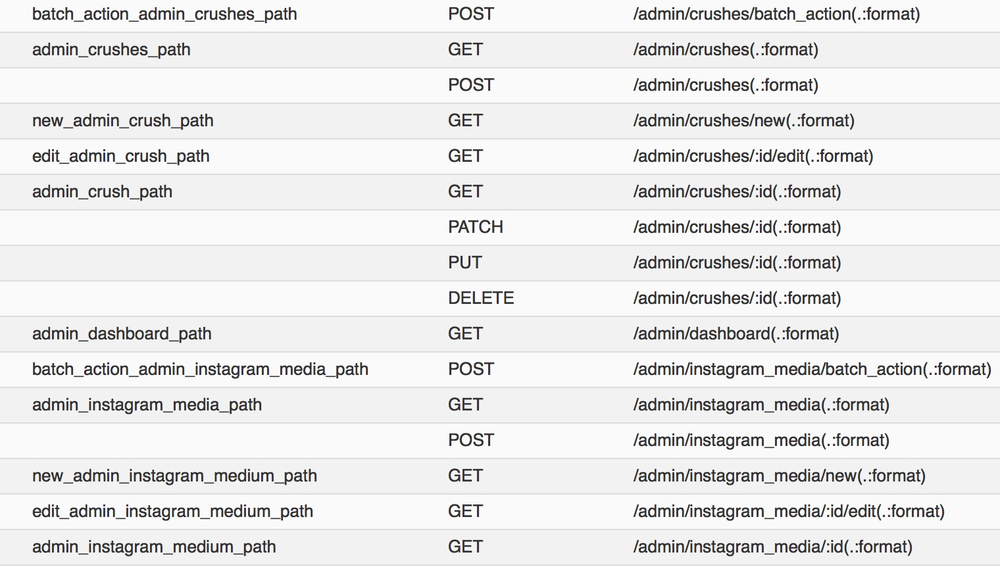
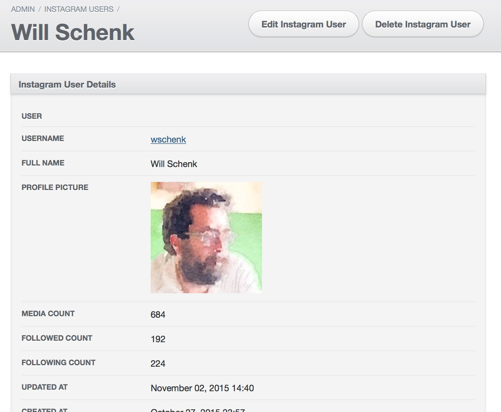
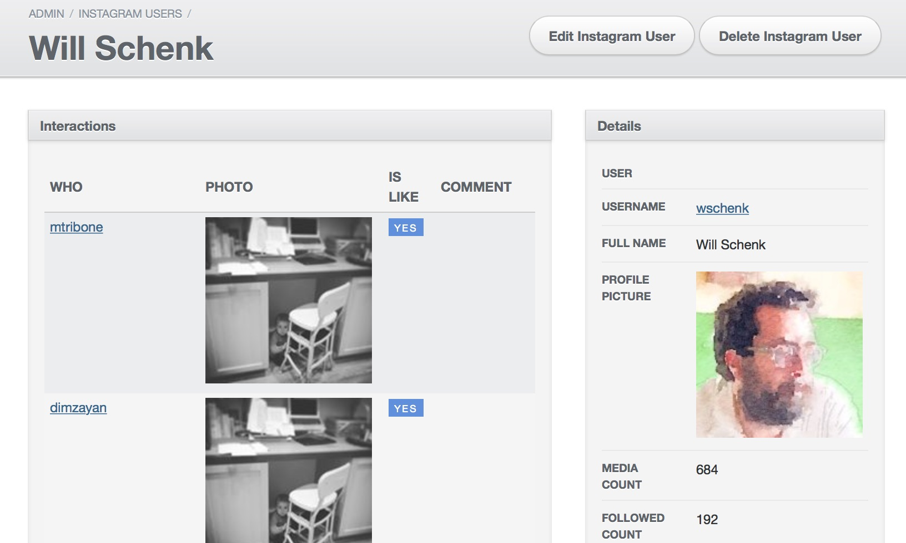

# Admin Tool

Ok, so we've mocked out the UI, lets go through and add a quick admin tool so that we can see what's going on.

First, let's run the generator and commit the changes.

```
$ rails g happy_seed:admin
$ rake db:migrate
$ git add .
$ git commit -a -m "Applied happy_seed:admin"
```

Lets go to the console now, and create a basic admin user.

```
$ rails c
Loading development environment (Rails 4.2.4)
[1] instacrush_tutorial »  AdminUser.create!(email: 'admin@example.com', password: 'password', password_confirmation: 'password')
```

Restart your server, and go to http://localhost:3000/admin

This is what you should see:



Enter in `admin@example.com` and `password`, or whatever you chose to generate above.

Here's the default dashboard:



## Changing the charts

First thing we'll do is to change what is displayed on the charts.  This is defined in the file app/admin/dashboard.rb

Lets add a few more panels in there, so that we can graph out some highlevel things we're interested in seeing.

```
ActiveAdmin.register_page "Dashboard" do

  menu priority: 1, label: proc{ I18n.t("active_admin.dashboard") }

  content title: proc{ I18n.t("active_admin.dashboard") } do
    columns do
      column do
        panel "Users" do
          render partial: "admin/chart", locals: { scope: 'users' }
        end
      end
    end

    columns do
      column do
        panel "Instagram Users" do
          render partial: "admin/chart", locals: { scope: 'instagram_users' }
        end
      end
      column do
        panel "Crushes" do
          render partial: "admin/chart", locals: { scope: 'crushes' }
        end
      end
    end

    columns do
      column do
        panel "Likes" do
          render partial: "admin/chart", locals: { scope: 'likes' }
        end
      end
      column do
        panel "Comments" do
          render partial: "admin/chart", locals: { scope: 'comments' }
        end
      end
    end
  end
end
```

Now we need to change the admin/stats controller, in `app/controllers/admin/stats_controller.rb` to return the right data for the scopes that we pass in.

```
class Admin::StatsController < ApplicationController
  before_filter :authenticate_admin_user!

  def stats
    if params[:scope].blank?
      render :json => { :errors => "scope not set" }, :status => 422
    else
      cls = User
      cls = Identity.where( "provider = ?", "twitter" ) if params[:scope] == 'twitter_users'
      cls = InstagramUser if params[:scope] == 'instagram_users'
      cls = Crush if params[:scope] == 'crushes'
      ret = cls.group_by_day

      if params[:scope] == 'likes' || params[:scopes] == 'comments'
        cls = InstagramInteraction.where( "is_like = ?", params[:scope] == 'likes' )
        ret = cls.group_by_day :updated_at
      end

      render json: ret
    end
  end
end
```

Now when we reload the page we're able to see basic charts for the different tables we are generating data for.

## Adding in some models

Lets create a few models inside of `app/admin`

`app/admin/crush.rb`:

```
ActiveAdmin.register Crush
```

`app/admin/instagram_user.rb`:

```
ActiveAdmin.register InstagramUser
```

`app/admin/instagram_media.rb`:

```
ActiveAdmin.register InstagramMedia
```

If we go back to the admin tool now, we see the different models in the header.



It also adds a number of routes:



Now that we have these routes, lets start customizing each of these pages.

## Crush

For the crush object, lets change a few things.
- Move Crush in the menu bar to the left.
- Change the filters on the right, to type in the username instead of the big drop down.
- Show the usernames instead of the IDs, and link them to the admin tool
- Have the slug link directly to the main profile.
- Fix the view path, since we used the `friendly_id` gem to change the routes for `Crush` objects.

Changing the filters is done using the `filter` DSL on Crush.  One of the nifty tricks here is that if we say `:instagram_user` it will use a drop down of all of the InstagramUsers in the system, but if we add `_username` it will filter on an attribute of the child element.  We'll do the same for `crush_user`.

We're also redefining the `index` view for the crush admin too.  Notice that we are using the named routes to link to other parts of the admin tool.


```
ActiveAdmin.register Crush do
  menu priority: 2

  filter :instagram_user_username, as: :string
  filter :crush_user_username, as: :string
  filter :slug
  filter :likes_count
  filter :comments_count

  index do
    selectable_column
    column :id
    column :main_username do |c|
      link_to c.instagram_user.username, admin_instagram_user_path( c.instagram_user )
    end
    column :crush_username do |c|
      link_to c.crush_user.username, admin_instagram_user_path( c.crush_user )
    end
    column :likes_count
    column :comments_count
    column :slug do |c|
      link_to c.slug, c
    end
    column :created_at
    actions
  end
  
  controller do
    def find_resource
      Crush.where(slug: params[:id]).first!
    end
  end
end
```

Also verify that the `View` action works with the custom id field!

## InstagramUser

Next, lets click on your crush's instagram user name and fix that error, and show the users's photo:

```

ActiveAdmin.register InstagramUser  do
  show do
    attributes_table do
      row :user
      row :username do
        link_to resource.username, "http://instagram.com/#{resource.username}"
      end
      row :full_name
      row :profile_picture do
        image_tag resource.profile_picture
      end
      row :media_count
      row :followed_count
      row :following_count
      row :updated_at
      row :created_at
    end
    active_admin_comments
  end

  controller do
    def find_resource
      InstagramUser.where(username: params[:id]).first!
    end
  end
end
```

Hrm, sort of boring:



Lets instead, show that informatio in the sidebar, and in the main area show a list of the interactions that have happened on my photos.  We'll change our `attributes_table` into a `sidebar`, and then loop through `instagram_interactions` in the main area:

```
ActiveAdmin.register InstagramUser  do
  menu priority: 4

  show do
    panel "Interactions" do
      table_for instagram_user.interactions do
        column :who do |r|
          link_to r.instagram_user.username, admin_instagram_user_path( r.instagram_user )
        end
        column :photo do |r|
          image_tag r.instagram_media.thumbnail_url
        end
        column :is_like
        column :comment
      end
    end
    active_admin_comments
  end

  sidebar "Details", only: :show do
    attributes_table do
      row :user
      row :username do
        link_to resource.username, "http://instagram.com/#{resource.username}"
      end
      row :full_name
      row :profile_picture do
        image_tag resource.profile_picture
      end
      row :media_count
      row :followed_count
      row :following_count
      row :updated_at
      row :created_at
    end
  end

  controller do
    def find_resource
      InstagramUser.where(username: params[:id]).first!
    end
  end
end
```

Better:



###