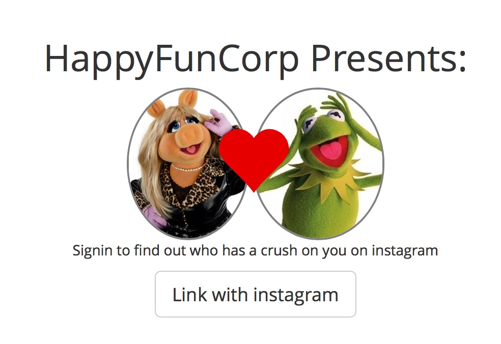

# Bootstrap Mocking out the UI

Now that we have some of the data in the database, we’re going to put all of that down and start to wrk on the UI.  We’re going to be building “wireframes with bootstrap”.  We’re not going to worry yet about wiring things up, we just want to throw something up on the screen that we can talk with people about, to help communicate what this app is.  Not totally sure what it is, so this is a good way to start having that conversation.

Once we get a good idea of how its structured and how things fit together, we’ll start to tweak some of the bootstrap SASS code so it doesn’t make your eyes bleed being so generic.

And finally, once we get something actually working that we can show to people, we’ll take what we’ve learned and bring in a real designer.

## Check out the scaffolding

We used the scaffold generators to create the `InstagramUser`, `InstagramMedia`, and `InstagramInteraction` models, so we’ll have some basic crud stuff in place.  Here are the links for this:

- http://localhost:3000/instagram_users
- http://localhost:3000/instagram_media
- http://localhost:3000/instagram_interactions

If you don’t have any data in here, log on to the console and run the sync command directly:

```
$ rails c
[1] instacrush_tutorial »  InstagramMedia.recent_feed_for_user User.first
```

And now if you go back to your browser you should see plenty of data on the page.

Lets ignore all of that for now.

## Building a clickable prototype

We know we are going to need a few pages.  Lets focus on just building this HTML for now, doing some basic styling, and making sure that it all fits together from a user flow before we start wiring it up.  This thing is called instacrush, so lets make sure to include a crush page.

Based on our exploration of the feed, lets come up with a few things that we’ll want to show off:

- Landing page
- Calculating page
- Crush page (it is call instacrush after all)
- Top Users
- Top Posts

Lets start with these:

```
$ rails g controller welcome landing calculating show_crush top_users top_posts
```

This creates a `WelcomeController` and a bunch of basic views that we can start mocking things out in.  This creates a number of get routes in `routes.rb` that we’ll be using.  We’re going to use route helpers everywhere, so when we eventually move the files around we’ll be able to tell where things break.  Lets change that to make sure our landing page is the root of the site:

```
  root 'welcome#landing'
```

And we can fix up the navbar, in `app/views/application/_header.html.haml` so we have a `Log in` link or a link to the feed in the header.  This is using the `bh` gem, which makes it a lot easier to throw in bootstrap components on the page.

```
= navbar position: :static do
  = vertical do
    = link_to root_path do
      %span.glyphicon.glyphicon-heart
      Crush
  = horizontal do
    = nav class: 'navbar-right' do
      = link_to "Crush", welcome_show_crush_path
      = link_to "Top Users", welcome_top_users_path
      = link_to "Top Posts", welcome_top_posts_path
      = render partial: "application/account_dropdown"
```

Start up the server and see what we have.  You’ll notice that when we click on “Crush” or “Top Users” the navbar will have the right highlighting, the link we be marked as active.  This is part of the work that the `bh` gem does for us.

## Seeing random dots where you aren’t supposed to

One of the other things that the `bh` gem does for us is get confused when there is an exception thrown inside of a `nav` helper, and after that there will be unstyled `li` tags thrown everywhere.  The current solution is to restart your server for things to clean up.

## Landing page

In `app/views/welcome/landing.html.haml`.  We’ll use the `.center-panel` mixin provided by seed to center the view, and then create a new `crush_pane` component to put the images side by side.

```
.container
  .row
    .center-panel.text-center
      %h1 HappyFunCorp Presents:

      .crush_pane
        .person
          =image_tag "https://upload.wikimedia.org/wikipedia/en/2/22/MissPiggy.jpg"
        .heart
          %span.glyphicon.glyphicon-heart
        .person
          =image_tag "https://upload.wikimedia.org/wikipedia/en/6/62/Kermit_the_Frog.jpg"

      %p
        Signin to find out who has a crush on you on instagram


      .signin
        = button_to "Link with instagram", welcome_calculating_path, class: "btn btn-default btn-lg", method: :get
```

And lets add some css to layout Kermit and Miss Piggy.  We’re going to call that the `.crush_pane` component, so we’ll create `app/assets/stylesheets/components/_crush_pane.scss` and drop in the following code:

```
.crush_pane {
  text-align: center;

  div {
    display: inline;
  }
  .person {
    img {
      border-radius: 100%;
      border: 2px solid gray;
      max-height: 150px;
    }
  }

  .heart {
    margin-left: -40px;
    margin-right: -40px;
    span {
      postion: relative;
      top: 30px;
      color: rgb( 230, 0, 0);
      font-size: 75px;
    }
  }    

  @include clearfix;
}

```

Finally, we need to make sure that our component is loaded in `application.scss` by throwing in the component section:

```
@import 'components/crush_pane';
```
Reload and we should now get:



## Looking at application.scss

This is the main stylesheet of the application.  It’s broken into multiple parts, including things not just from the `bootstrap-sass` gem, but also a series of directories inside of `app/assets/stylesheets`

- globals, for bootstrap customization variables and fonts.
- mixins, for sass functions that the rest of your stylesheet will use.
- shared, for styles that cut across different components, for example theming bootstrap components.
- components, specific things that are reusable across many parts of the site.
- sections, targeting specific page tweaks.

This is a way to keep things organized as your application grows.  We’re creating a `crush_pane` component that we’re using on the homepage as well as the show crush page (one assumes).

## Calculating

Based upon how long our tests were running, we’ll need some sort of interstitial page that the user can hang out on while things are loading.

`app/views/welcome/calculating.html.haml`:

```
.container
  .row
    .center-panel
      %h1 Talking to instagram...

      = progress_bar percentage: 0, animated: true

- content_for :javascripts do
  :javascript
    $( function() {
      var value = 0;
      var update_value = function() {
        value = value + 5;
        if( value > 100 ) {
          window.location = '#{ welcome_show_crush_path }';
        }

        $(".progress-bar").css('width', value+'%').attr('aria-valuenow', value);
      }

      setInterval( update_value, 250 );
    } );
```

Here is an example of using javascript in HAML.  This page is basically just a bootstrap progress bar, but we have a simple method that updates the value 4 times a second and once it’s up to 100%, it changes the location to the `welcome_show_crush_path`.  Easy breezy.

## Show crush 

Here’s the crush pane.

```
.container
  .row
    .center-panel.text-center
      = panel title: 'Your Crush' do
        .panel-body
          .crush_pane
            .person
              =image_tag "https://upload.wikimedia.org/wikipedia/en/2/22/MissPiggy.jpg"
            .heart
              %span.glyphicon.glyphicon-heart
            .person
              =image_tag "https://upload.wikimedia.org/wikipedia/en/6/62/Kermit_the_Frog.jpg"

          .stats
            %code
              @user
            has hearted your photos
            %b 123 times!


      .row
        .col-xs-6.text-center
          = link_to "Top Users", welcome_top_users_path, class: "btn btn-primary btn-lg"
        .col.xs-6.text-center
          = link_to "Top Posts", welcome_top_posts_path, class: "btn btn-primary btn-lg"
```

We’re reusing the `crush_pane`, so we get that styling again.

## Top Posts

Lets just show some photo thumbnails, and sort the results by number of interactions.

```
.container
  .page-header
    %h1
      Top posts
      %span.small based on interactions

  .row
    - 15.times do 
      .col-xs-6.col-sm-4.col-md-3
        .thumbnail
          = image_tag "http://placehold.it/350x350"

          .caption
            %p
              %b Photos with so many likes

```


## Top Users

Lets show a list of users on the left, and the the photos that they’ve liked on the right.  Maybe with a little info about the user we’ve selected?  Lets try it.

```
.container
  .row
    .col-sm-3
      = panel title: "Top Users" do
        .panel-body
          = nav as: :pills, layout: :stacked do
            - 5.times do |time|
              = link_to "#" do
                = "Person ##{time}"
                %span.badge= 10-time

    .col-sm-9
      .row
        .col-sm-12
          = panel title: "User Info" do
            .panel-body.user_info
              .col-xs-3
                = image_tag "http://placehold.it/75x75", class: "img-responsive"

              .col-xs-9
                %p Username has 12 followers, 82 posts.
                %p Username has liked 15 of your photos, and made 92 comments.

      .row
        - 15.times do 
          .col-xs-6.col-sm-4.col-md-3
            .thumbnail
              = image_tag "http://placehold.it/350x350"

              .caption
                %p
                  %b Photos with so many likes

```

We’re using the ruby `times` method to generate some fake data to display.  In this case, 5 users to select from and 15 photo thumbnails.  Notice that we are using the exact same html for display the thumbnails on this page, vs the top posts page.

## To sum up

Right now we’ve thrown together a number of interconnecting pages that we can use to talk about the design and wireframing of the site.  This really is where you should stop, and to talk to people about what you’ve done.

1. You’ve got some theories on what the api can do.
2. You’ve validated and pulled in the data.
3. There’s clickable wireframes that you can demo.

There’s enough right now in place to get some feedback on what you are thinking about building.  Does it make sense right now that you click on “Top Users” and it doesn’t show you a list of users but rather photos that they’ve liked?  Do people care about the crush at all?  What about the top photos, is that enough?

Its important to show this to someone and talk it through as soon as possible.  There are 2 things that we are going to do next.  One is to slap a coat of paint on it, so it doesn’t look so boring, and the next is to start wiring it up to the database.  Why show people before this doing that?

Right now what you are showing people is an obvious outline.  It’s written in crayon, clearly a draft.  Its easy to talk about right now, the possibilities are very fluid.  Once you start wiring more up, you start to hold on to specific solutions and that inertia will take a live of its own.  You’ll wire up something in a particular way, and when someone suggests changing it to you’ll be reluctant to change it for the simple reason that you already put the effort into making it one way, rather than another.

So talk it through with someone before you play around with it too much more.

```
$ git add .
$ git commit -a -m "Bootstrap wireframes"
```

(Github link: https://github.com/HappyFunCorp/instacrush_tutorial/commit/67c81fe5d3b43ea2ff5079fed5087ba121bc8eef)