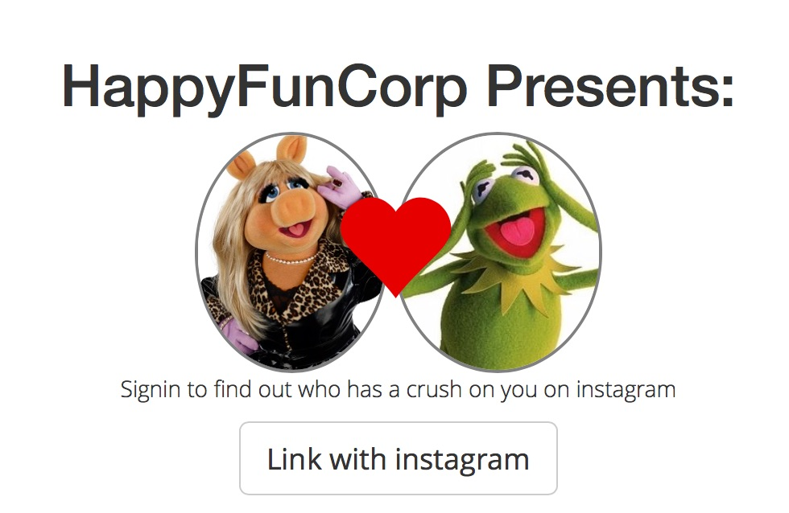
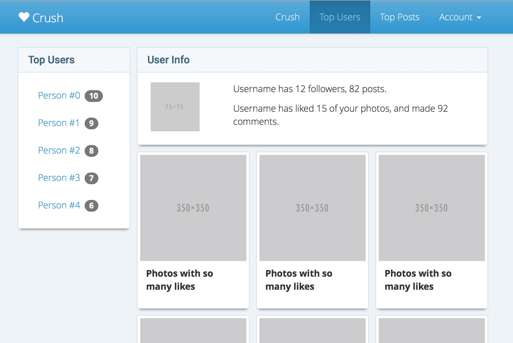

# Bootstrap: Styling

We’re going to assume that we like what we have.  Lets go through an do some basic tweaks to the SASS files, leaving the HTML alone, to change how the app is looking.

## Levels of bootstrap modification

1. Using a pre-built theme
2. Tweaking bootstrap variables
3. Using bootstrap mixins to style components
4. Building things from scratch


## Using the bootstrap-theme

Inside of application.scss, lets include the base bootstrap theme included in the main distribution.  Add the import of `bootstrap/theme` after importing bootstrap.

```
// --------------Bootstrap-----------------------------
@import 'bootstrap-sprockets';
@import 'bootstrap';
@import 'bootstrap/theme';
```

If you load the site now, you’ll see that gradients have been added to the navigation bar and than the buttons look different.  If we comment out that line, then it goes back to being super flat.  Lets take it out, and define a few things ourselves.

```
// --------------Bootstrap-----------------------------
@import 'bootstrap-sprockets';
@import 'bootstrap';
// @import 'bootstrap/theme';
```

## Where can I find more info?

I like to open up the `bootstrap-sass` source to see what variables are available and what can be changed.  Therefor, I type this in a lot:

```
$ sublime `bundle show bootstrap-sass`
```

Inside of this, you can see the main customizable variables inside of `assets/stylesheets/bootstrap/_variables.scss`.  The variables themselves are verbosely named, so you can get a good idea of what they control by guessing.  And when that doesn’t work, searching the rest of the source for more info.  Lets go through at tweak a few things.

## Fonts

Lets make some immediate typography changes.  First we’ll import a few google fonts inside of `app/assets/stylesheets/globals/_font.scss`:

```
@import url(https://fonts.googleapis.com/css?family=Roboto:400,500);
@import url(https://fonts.googleapis.com/css?family=Open+Sans:300);
```

And then we’ll head to our main file that we’ll customize bootstrap with, `_variables.scss`.  Here we are going to change 2 properties, `$font-family-sans-serif` and `$headings-font-family`.  Additionally we’re going to light up the base font weight for the document.

```
$font-family-sans-serif: 'Open Sans', "Helvetica Neue", Helvetica, Arial, sans-serif;
body { font-weight: 300; }
$headings-font-family: 'Roboto', "Helvetica Neue", Helvetica, Arial, sans-serif;
```

Give a reload and see the difference:



## Spacing

I think that the thumbnails on the top users and top posts have way too much space there.  Let’s shrink the gutter size for the grid overall to 10px.

```
// Grid

$grid-gutter-width: 10px;
```

This makes things better horizontally, but we’ll need to shrink the space vertically.  We’ll note this and do it later.

## Borders

The stock stuff is too rounded for the crisp, instagram experience we are going for.  Lets sharpen it up

```
// Radii

$border-radius-base:        2px;
$border-radius-large:       3px;
$border-radius-small:       1px;
```

## Colors

Next lets change some colors.  The first the things are our own variables which we will be using later.  

```
// Color definitions (play with these)

$background-color: rgb(245, 248, 250);
$border-color: #d3e0e9;
$header-color: darken( $border-color, 50% );

// Site colors
$brand-primary: rgb(48, 151, 209);
$body-bg: darken( rgb(245, 248, 250), 2% );
```

Looks like the nav bar needs some help next, so lets use what we’ve just defined and tweak that:

```
// Navbar

$navbar-default-bg: $brand-primary;
$navbar-default-border: darken( $border-color, 20% );
$navbar-default-color: lighten( $navbar-default-bg, 40% );
$navbar-default-brand-color: lighten( $navbar-default-color, 10% );
$navbar-default-link-color: $navbar-default-color;
$navbar-default-link-active-color: darken( $navbar-default-link-color, 20% );
$navbar-default-link-hover-color: $navbar-default-link-active-color;
$navbar-default-toggle-icon-bar-bg: $navbar-default-border;
```

OK, now it looks like our default panels aren’t right, since they boring gray.  Let’s give them the blue tinge:

```
// Panels

$panel-default-border: $border-color;
$panel-default-heading-bg: $background-color;
$panel-default-text: $header-color;
```

Finally the thumbnails are getting lost in the blue backgorund, so lets give them a solid color:

```
// Thumbnail

$thumbnail-bg: white;
$thumbnail-border: $border-color;
```

## Component tweaks

Now that we’ve done the major changes, lets go through and make individual tweaks.  I think that the bootstrap-theme is a little too much everywhere, so lets make some changes of our own.

We’ll start with some basic stuff

inside of `app/assets/components/_panel.scss`

```
.panel {
  margin-bottom: $grid-gutter-width;
  @include box-shadow(0 5px 4px -4px rgba( 0,0,0,.5));
}

.thumbnail {
  margin-bottom: $grid-gutter-width;
  @include box-shadow(0 5px 4px -4px rgba( 0,0,0,.5));
}
```

## Nav components

This is largely copies from the bootstrap-theme:

`app/assets/stylesheets/components/nav.scss`, and make sure to `@import` it from `application.scss`

```
.navbar-default {
  @include gradient-vertical($start-color: lighten($navbar-default-bg, 10%), $end-color: $navbar-default-bg);
  @include reset-filter; // Remove gradient in IE<10 to fix bug where dropdowns don't get triggered
  $shadow: inset 0 1px 0 rgba(255,255,255,.15), 0 1px 5px rgba(0,0,0,.075);
  @include box-shadow($shadow);

  .navbar-nav > .open > a,
  .navbar-nav > .active > a {
    @include gradient-vertical($start-color: darken($navbar-default-link-active-bg, 5%), $end-color: darken($navbar-default-link-active-bg, 2%));
    @include box-shadow(inset 0 3px 9px rgba(0,0,0,.075));
  }
}


.nav-pills {
  > li {
    // Active state
    &.active > a {
      &,
      &:hover,
      &:focus {
        @include gradient-vertical($start-color: lighten( $nav-pills-active-link-hover-bg, 10%), $end-color: darken($nav-pills-active-link-hover-bg, 2%));
        @include reset-filter; // Remove gradient in IE<10 to fix bug where dropdowns don't get triggered
      }
    }
  }
}
```

## Footer

Create and link up a `app/assets/stylesheets/sections/footer.scss` file

```
$sticky_footer_height: 80px;

html {
  position: relative;
  min-height: 100%;
}

body {
  margin-bottom: $sticky_footer_height;
}

footer {
  // margin-top: 1em;
  position: absolute;
  bottom: 0;
  width: 100%;
  /* Set the fixed height of the footer here */
  height: $sticky_footer_height;

  @include gradient-vertical($start-color: lighten($navbar-default-bg, 10%), $end-color: $navbar-default-bg);
  @include reset-filter; // Remove gradient in IE<10 to fix bug where dropdowns don't get triggered
  @include box-shadow(inset 0 3px 5px rgba(0,0,0,.3));
  color: white;

  h3 {
    font-size: 1.2em;
    font-weight: 400;
  }

  a {
    color: white;
    &:hover,
    &:focus {
      color: white;
    }
  }
}
```

## Buttons

And finally, buttons, which we need to put in `app/assets/stylesheets/components/_btn.scss` and link up in `application.scss`

```
.btn-default,
.btn-primary,
.btn-success,
.btn-info,
.btn-warning,
.btn-danger {
  text-shadow: 0 -1px 0 rgba(0,0,0,.2);
  $shadow: inset 0 1px 0 rgba(255,255,255,.15), 0 1px 1px rgba(0,0,0,.075);
  @include box-shadow($shadow);

  // Reset the shadow
  &:active,
  &.active {
    @include box-shadow(inset 0 3px 5px rgba(0,0,0,.125));
  }

  &.disabled,
  &[disabled],
  fieldset[disabled] & {
    @include box-shadow(none);
  }

  .badge {
    text-shadow: none;
  }
}

// Mixin for generating new styles
@mixin btn-styles($btn-color: #555) {
  @include gradient-vertical($start-color: $btn-color, $end-color: darken($btn-color, 5%));
  @include reset-filter; // Disable gradients for IE9 because filter bleeds through rounded corners; see https://github.com/twbs/bootstrap/issues/10620
  background-repeat: repeat-x;
  border-color: darken($btn-color, 14%);

  &:hover,
  &:focus  {
    background-color: darken($btn-color, 5%);
    background-position: 0 -15px;
  }

  &:active,
  &.active {
    background-color: darken($btn-color, 7%);
    border-color: darken($btn-color, 7%);
  }

  &.disabled,
  &[disabled],
  fieldset[disabled] & {
    &,
    &:hover,
    &:focus,
    &.focus,
    &:active,
    &.active {
      background-color: darken($btn-color, 12%);
      background-image: none;
    }
  }
}

// Common styles
.btn {
  // Remove the gradient for the pressed/active state
  &:active,
  &.active {
    background-image: none;
  }
}

// // Apply the mixin to the buttons
.btn-default { @include btn-styles($btn-default-bg); text-shadow: 0 1px 0 #fff; border-color: #ccc; }
.btn-primary { @include btn-styles($btn-primary-bg); }
.btn-success { @include btn-styles($btn-success-bg); }
.btn-info    { @include btn-styles($btn-info-bg); }
.btn-warning { @include btn-styles($btn-warning-bg); }
.btn-danger  { @include btn-styles($btn-danger-bg); }
```

## Now at least it looks on purpose




```
$ git add .
$ git commit -a -m "Customized bootstrap"
```

(Github link: https://github.com/HappyFunCorp/instacrush_tutorial/commit/373ff8a111d530fd5f16a6ad3619bb284e66e0c3)