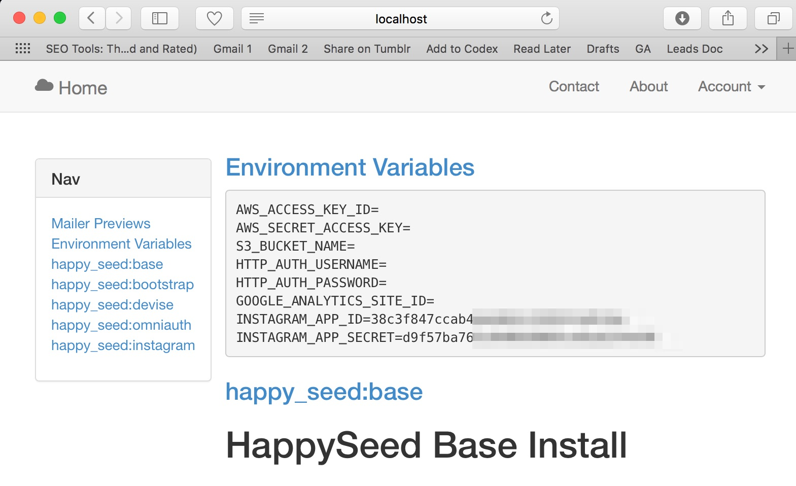
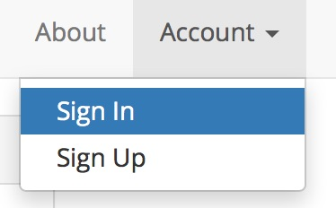
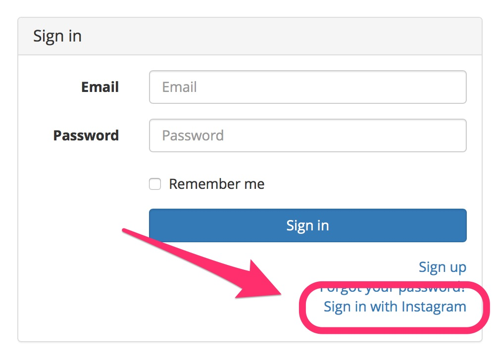
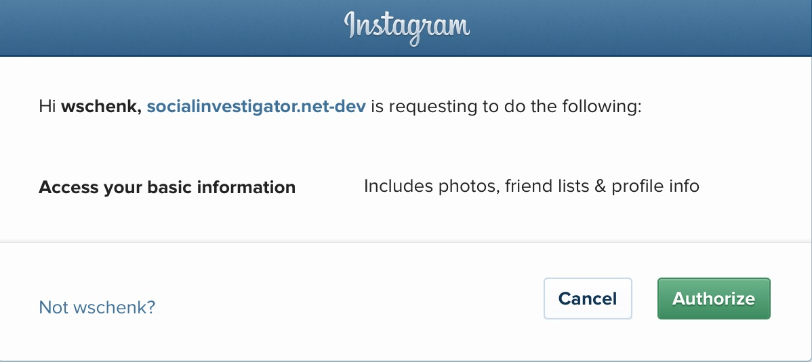
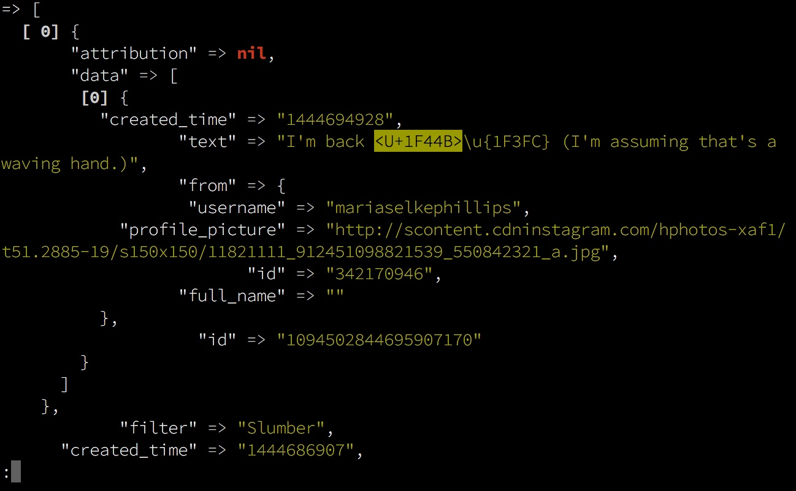

# Exploring the Instagram API

First thing we need to do is to see what we can get from Instagram.  This is a two step process.

1. Look through the Instagram API documentation to see what’s there.
2. Build an app to start pulling down the data for real.

## Instagram Documentation

First step: google “instagram api”.  Look at what end points are available.

`/users/self/feed` looks pretty good.

We’ll need to create a client application for us to connect to instagram, so lets do that now.

First go to _Manage Clients_ and then _Register a new Client_.

Register a dev app (we’ll need another one for production) that we’ll use for testing.  Call back URL should be: `http://localhost:3000/users/auth/instagram/callback`  Note the client id and client secret, since we’ll use that soon.

## Setup the initial rails app

Install seed if you haven’t:

```
$ gem install happy_seed
```

Generate the basic app:

```
$ happy_seed rails instacrush
```

For now, say no to everything.  We’ll install the `happy_seed:instagram` generator shortly.

```
$ cd instacrush

$ rails g happy_seed:instagram
```

This will install lots of things.  After it’s done, lets commit what’s there to the repo so we can isolate the changes that we will make.

```
$ git add .
$ git commit -a -m "Applied happy_seed:instagram"
```

(Github link: https://github.com/HappyFunCorp/instacrush_tutorial/commit/0cabd4b7356d2ca11638b580a7100f08d813ecb4)

Lets edit the `.env` file, and put in the client id and secret that we got above:

```
INSTAGRAM_APP_ID=38c3f847…
INSTAGRAM_APP_SECRET=d9f5…
```

## Get an access token

Lets create the database and then start the server:

```
$ rake db:migrate && rails s
```

Go to http://localhost:3000 and let see what we have:



This is the setup page for seed.  It just gives you an overview of what has been installed.  You can look through the documentation more, but what we’re after is authenticating ourselves with Instagram so we can start talking.  Lets go to the account menu and select _Sign In_.



Now lets sign in with Instagram:



And you’ll get prompted to grant access to your application:




Say _Authorize_, and then you should be good to go:


Cool!  We now have access, so lets go to the terminal and start poking around.

## Now lets see what the data looks like for real

We’re going to go to the terminal and see what exactly the api returns.  Start up the console with:

```
$ rails console
```

First we load up the client:

```
> client = User.first.instagram_client
 => #<Instagram::Client:0x007feebf8a9610 @access_token="509161.38c3f84.10f08b0e76634691b6740ac2420a0b11", @adapter=:net_http, @client_id=nil, @client_secret=nil, @client_ips=nil, @connection_options={}, @scope=nil, @redirect_uri=nil, @endpoint="https://api.instagram.com/v1/", @format=:json, @proxy=nil, @user_agent="Instagram Ruby Gem 1.1.6", @no_response_wrapper=false, @loud_logger=nil, @sign_requests=false> 
```

Now we can try and get the feed:

```
> client.user_feed
NoMethodError: undefined method `user_feed' for #<Instagram::Client:0x007feebf8a9610>
```

Opps.  Wrong command, lets try again:

```
> client.user_recent_media
 => [#<Hashie::Mash attribution=nil caption=#<Hashie::Mash created_time="1444686907" from=#<Hashie::Mash full_name="Will Schenk" id="509161" profile_picture="http://scontent.cdninstagram.com/hphotos-xaf1/t51.2885-19/11374591_955491831180543_1527410442_a.jpg" username="wschenk"> id="1094435605103839312" text="Slow mo action shot"> comments=#<Hashie::Mash count=1 data=[#<Hashie::Mash created_time="1444694928" from=#<Hashie::Mash full_name="" id="342170946" profile_picture="http://scontent.cdninstagram.com/hphotos-xaf1/t51.2885-19/s150x150/11821111_912451098821539_550842321_a.jpg" username="mariaselkephillips"> id="109450284469
```

And now we have pages and pages of results, but it’s a mess!  Lets install some better console tools.  Exit out of the rails console and install the `happy_seed:jazz_hands` generator.

```
$ rails g happy_seed:jazz_hands
$ git add . && git commit -a -m "Applied happy_seed:jazz_hands"
```

(Github link: https://github.com/HappyFunCorp/instacrush_tutorial/commit/80e062a2385e35cf8cee47e1b33ec5ae86a6d140)

Lets start up the console again, and see what it looks like:

```
$ rails c
[1] instacrush »  client = User.first.instagram_client
[2] instacrush »  client.user_recent_media
```

And I’m going to give you a screenshot so you can see the difference in all of it’s splendor:



You can use the arrow keys, or `/` to search, to navigate through the results and get a better sense of what is there.  Having a large window really helps.

## Analyzing the API 

We’re going to start poking through the data, and to “try and understand it.” This is not a staightforward process. We’re going to stare at it, make up some questions and see if we can get the data to answer them, basically immerse ourselves in it to see what’s possible.  Some of the things that I think are interesting are:

1. Am I cool on instagram?  What does it mean to be cool?
2. Is it about how many people like and comment on my stuff?
3. Are there patterns I can find about how people interact in the data?
4. What about the asymmetry of followers and following?  What about people who comment on my things who I don’t follow?
5. Are there people I don’t follow that I should who are interacting with me?

Basically, I’m wondering what there is in my data that I can see.  I’m sure in Instagram HQ there’s many more things that they know about, but we’re probably going to be very limited with the data that is available.  Let’s get in there and start seeing what’s in there, what we can possibly get out, and what we can realistically get out.

This last point, what we can really get out vs. what is possible, is going to be a major design challenge.  If we could run our queries across the main database — things that are possible to get out — we’d be able to learn a lot more than what is easily exposed in the API.  API’s have rate limits, which prevents doing a full scrape of the database, and there’s only so much you can do.

For example, some people have millions of followers, and it’s unlikely that you’ll be able to pull a list of them down without the API exploding in someway.  Either you hit a rate limit, it would take too much time, or you blow through some sort of usage expectation.  If you had the data locally it would be a “simple union operation” but having the pull everything down and iterate over it means that some use cases, figuring out followers two users have in common for example, aren’t realistically possible.

## What do we see: `user_recent_media`

OK, we identified the main feed API as something worth looking into, so get’s get into and see what we can find.

1. We get lists of comments and likes for each post.
2. User info is embedded, including username, profile picture, and full name.
3. Comments have a `created_at` timestamp, while likes don’t.
4. There’s no following/follower information.
5. Users mentioned in post is interesting.

Profile data is included in the response.  If you compare with looking at a user directly, we get a little bit more information, specifically urls, counts of posts, and counts of both directions of following:

```
[3] instacrush »  client.user
=> {
         "username" => "wschenk",
              "bio" => "",
          "website" => "http://willschenk.com",
  "profile_picture" => "http://scontent.cdninstagram.com/hphotos-xaf1/t51.2885-19/11374591_955491831180543_1527410442_a.jpg",
        "full_name" => "Will Schenk",
           "counts" => {
          "media" => 678,
    "followed_by" => 190,
        "follows" => 224
  },
               "id" => "509161"
}
```

If we wanted to display that information on the front end we’d need to query it for each user.  It probably makes sense to query it for the active user, but may not scale if we need to query it for everyone else.

Additionally, comments have a `created_at` timestamp, while likes don’t.  We could order posts and comments onto a timeline if we wanted, but there’s no way to really figure out when someone liked a photo from this information.

And there’s no friend status with the user information.  When someone likes something on the feed, or comments on it, there’s no way to tell (from this api query) that the current user is following that user, or if that user is following them in return.  (Perhaps they found the photo through a tag or a search, and liked it without following the current user.)

Lets see about who the user is following, and who is following them.

## What do we see: `users/{user-id}/follows` 

If we look at the raw follow response, we get a list of users again with the small set of data, no counts or urls:

```
[4] instacrush »  client.user_follows
=> [
  [ 0] {
           "username" => "user1",
    "profile_picture" => "http://scontent.cdninstagram.com/hphotos-xfa1/t51.2885-19/s150x150/11821352_722579544513251_1509131383_a.jpg",
                 "id" => "1",
          "full_name" => "Maggie"
  },
  [ 1] {
           "username" => "user2",
    "profile_picture" => "http://scontent.cdninstagram.com/hphotos-xaf1/t51.2885-19/s150x150/11821111_912451098821539_550842321_a.jpg",
                 "id" => "2",
          "full_name" => ""
  },
  [ 2] {
           "username" => "user3",
    "profile_picture" => "http://scontent.cdninstagram.com/hphotos-xap1/t51.2885-19/10684059_1609998932601067_842692769_a.jpg",
                 "id" => "2098229560",
          "full_name" => "Agriturismo Tenuta Chiudendone"
...
```

Lets look at the results count, which is always interesting.  Here we can see that it’s loading 50 users, when I know from above that I’m following `224`.

```
[5] instacrush »  client.user_follows.count
=> 50
```

We’ll need to use pagination to get the next list.  When we get a result there will be a `pagination` property in the results.  In that case we can pass back the cursor to the next call to iterate through everything.  This is probably going to be messy.

Here’s an example:

```
[6] instacrush »  uid = User.first.instagram.uid
[7] instacrush »  cursor = nil
=> nil
[8] instacrush »  loop do
               »    follows = unless cursor  
               »      client.user_follows uid    
               »    else    
               »      client.user_follows uid, cursor: cursor    
               »    end    
               »    follows.each { |follow| p follow['username'] }  
               »    cursor = follows.pagination.next_cursor  
               »    break if cursor.nil?  
               »  end  
```

This might work, but it’s going to be pulling down lots of data.  We’re going assume that `followed_by` is the same.

## What do we see: `/users/self/media/liked`

Here’s another interesting one: media that the current user has liked.  Lets take a look at the first response, since the pagination is probably the same as above.

```
[8] instacrush »  post = client.user_liked_media.first
```

But wait!  What is this?

```
[9] instacrush »  post.likes['count']
=> 29
[10] instacrush »  post.likes['data'].count
=> 4
```

The api says the liked count is 29, but only returns the first 4 users.  What about `user_recent_media`, does it to the same thing?  Lets go through a print out the count of what we get back vs what it tells us the count should be:

```
[11] instacrush »  client.user_recent_media.each { |x| puts "likes #{x.likes['data'].count} total should be #{x.likes['count']}" };nil
likes 4 total should be 12
likes 4 total should be 7
likes 4 total should be 21
likes 4 total should be 14
likes 4 total should be 25
likes 4 total should be 22
```

So it looks like we’ll need to query each one directly to see who all has liked it.

_Hrmph._

## What do we see: `/media/{media-id}/likes`

Can we query it directly?  Do the counts match up then?

```
[12] instacrush »  liked_people = client.media_likes post.id
[13] instacrush »  liked_people.count == post.likes['count']
=> true
```

Looks like that works.  Gonna be fun!

## The plan

OK, so it looks like we can pull down the user’s feed, and see who has commented and liked the photo.  We’ll get all of the comments, but we’ll need to load in who liked the photos individually.  We can also find the media that the current user has liked, but again, we’ll need to query the post directly in order to get all of the data.

Based on this info, we can keep track of all of the users that have interacted with the user’s feed.  Lets start with this, and see what we can come up with.
